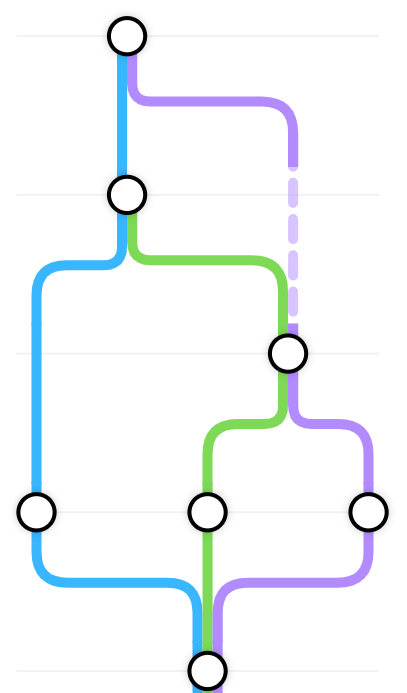

# Three Whales

Current development repo for the Three Whales website.

Three Whales is a site run by three individuals - each assigned their own 'whale' (represented in the real world by actual crochet whales).

It is a blog site, with the ability to create posts and add images.

On the home (timeline) page, the travels of the three whales are displayed by an interactive tube-map style layout, tracking when the whales are together or apart. This graph is created dynamically at runtime - automatically updating to reflect the most recent posts.

## Tech stack
### Front-End
- Vite React App
- NodeJS
- TailwindCSS
- Framer Motion

### Back-End
- Google Firebase